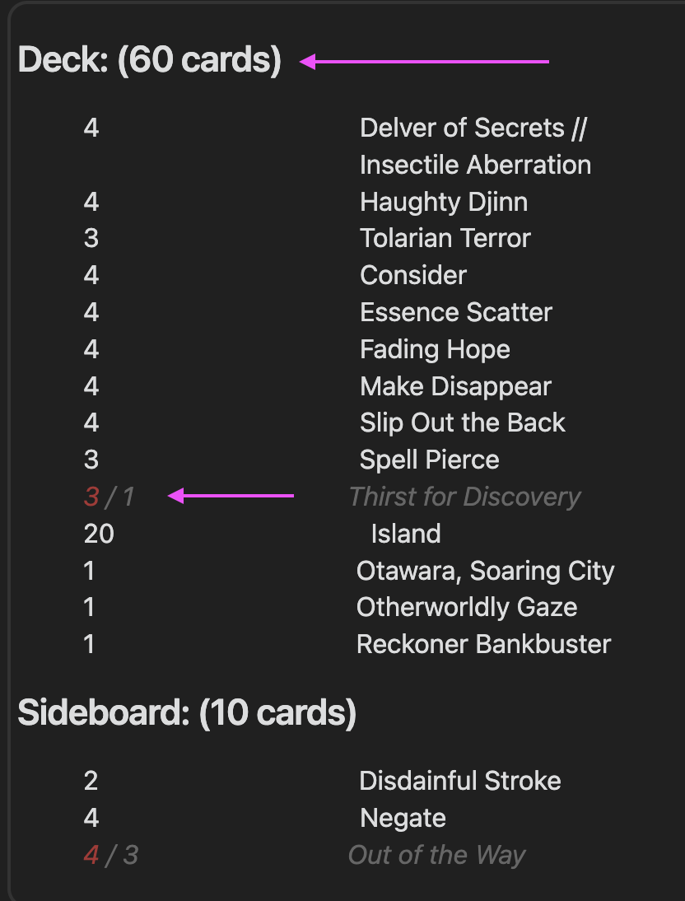
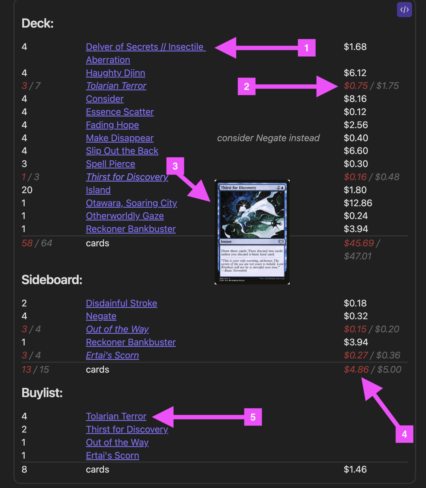
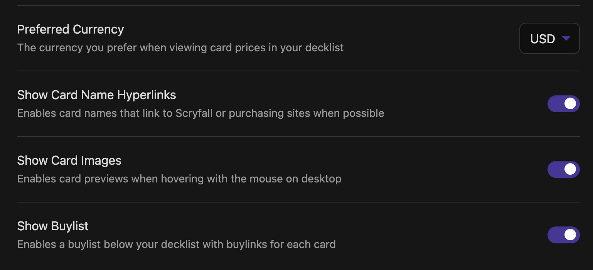

# Changelog

## 2022-09-24
- 
    - Updated the look of "insufficient" card state to just a red styling on the numeric count.
    - Added totals next to the section name

## 2022-09-25
- Handling Arena copy pasting with set codes
- Fixing issue with 1st section header
- Added more flexibility with section header names
- Fixed single-line comment issues
- Added `husky` and a pre-commit hook
- Added `eslint` task

## 2022-10-02
- Adding support for `jest` testing
- Adding tests for `renderer`
- Simplifying the DOM for cleaner line rendering
- Adding CircleCI config
- Adding jest config

## 2022-10-10
- Added connection to [Scryfall API data](https://scryfall.com/docs/api)
- 
    1. Added hyperlinks to Scryfall for each card
    2. Added pricing information
    3. Added card artwork previews on hover
    4. Added total prices for each section
    5. Added a `Buylist` section
- 
    - Added feature flags in settings for image previews, hyperlinks and currency options for prices.
- Refactored multiple parts of the `renderer.ts` module.

## 2022-10-15
- Refactoring based on Community Plugin PR feedback:
    - remove the references to `innerHTML`
    - remove the leading dot from the file extension
    - using the TFile extension param instead of custom function
    - adding Prettier formatting and switching over to use createSpan,createDiv
    - adding custom csv parsing functions to remove `csv` dependency
    - removing `obsidian-plugin-mtg__` css prefix

## 2022-10-16
- Replacing node HTTP library with `obsidian.requestUrl`

## 2022-10-30
- Reducing the number of times collection is synced from file system to improve performance

## 2022-11-13
- Fixing the `modify` event callback's CSV file extension string pattern to include the `.` and avoid false matches

## 2023-03-24
- Merging two PRs:
    - [PR 20 - Correct README and settings display](https://github.com/omardelarosa/obsidian-mtg/pull/20)
    - [PR 22 - Allow cards to render past the box and makes default card size much bigger](https://github.com/omardelarosa/obsidian-mtg/pull/22)
- Updating the "Collection CSV" hint text to better describe what it does.