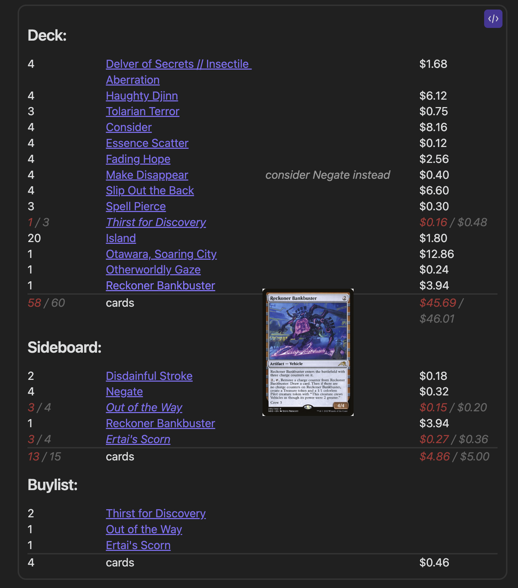
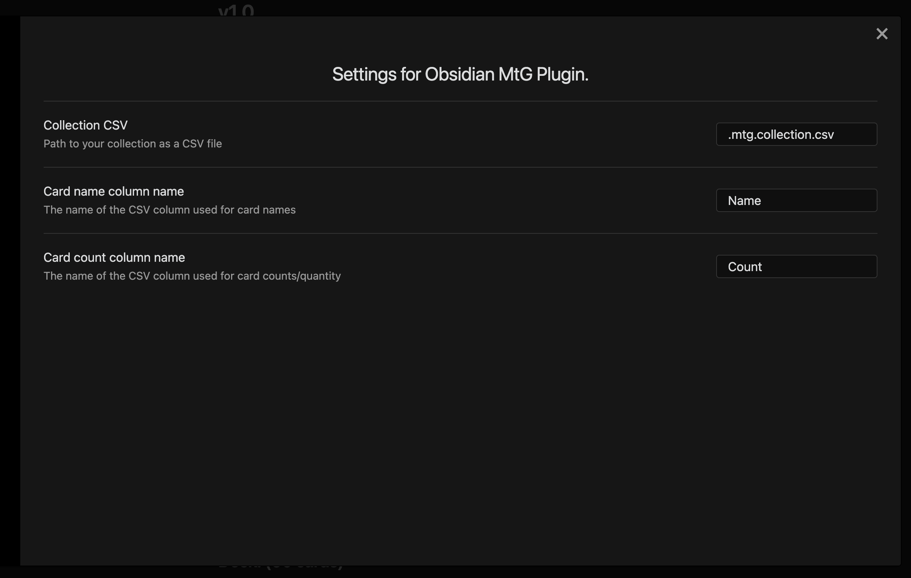

# Obsidian MtG Plugin

This is a plugin to manage your Magic: The Gathering card collections and decks as Obsidian notes.

## Decklists

Using the `mtg-decklist` syntax hint in any Markdown file, you can define your decklists as follows:

```mtgdeck
4 Delver of Secrets // Insectile Aberration
4 Haughty Djinn
3 Tolarian Terror
4 Consider
4 Essence Scatter
4 Fading Hope
4 Make Disappear # consider Negate instead
4 Slip Out the Back
3 Spell Pierce
3 Thirst for Discovery
20 Island
1 Otawara, Soaring City
1 Otherworldly Gaze
1 Reckoner Bankbuster

Sideboard:
2 Disdainful Stroke
4 Negate
4 Out of the Way
1 Reckoner Bankbuster
4 Ertai's Scorn
```

Which in turn renders as:



You can also copy paste directly from MTGA exports, though setlists and collector's numbers will not be shown and are not yet supported in the renderer.

## Collections

This plugin expects your collection to be stored as csv files with the extension `.mtg.collection.csv` by default.  This extension is configurable in settings:



These files are expected to be properly formed CSVs such as those generated by tools like [Deckbox](https://deckbox.org/)

### Example CSV Files

```
Name,Count,Set
Delver of Secrets // Insectile Aberration,8,MID
"Otawara, Soaring City",4,NEO
"Rona's Vortex",2,DMU
```

```
Name,Count,Set
Delver of Secrets // Insectile Aberration,1,MID
"Otawara, Soaring City",6,NEO
"Rona's Vortex",3,DMU
Ledger Shredder,5,SNC
```

Note that your collection will consist of the merged result of all of your CSV files.

# Contributing

See [the official Obsidian plugin guidelines](https://github.com/obsidianmd/obsidian-sample-plugin#obsidian-sample-plugin)