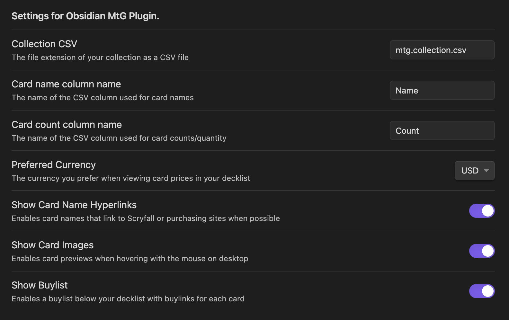

# Obsidian MtG Plugin

This is a plugin to manage your Magic: The Gathering card collections and decks as Obsidian notes.

## Decklists

Using the `mtg-decklist` syntax hint in any Markdown file, you can define your decklists as follows:

```mtgdeck
4 Delver of Secrets // Insectile Aberration
4 Haughty Djinn
3 Tolarian Terror
4 Consider
4 Essence Scatter
4 Fading Hope
4 Make Disappear # consider Negate instead
4 Slip Out the Back
3 Spell Pierce
3 Thirst for Discovery
20 Island
1 Otawara, Soaring City
1 Otherworldly Gaze
1 Reckoner Bankbuster

Sideboard:
2 Disdainful Stroke
4 Negate
4 Out of the Way
1 Reckoner Bankbuster
4 Ertai's Scorn
```

Which in turn renders as:


You can also copy paste directly from MTGA exports, though setlists and collector's numbers will not be shown and are not yet supported in the renderer.

## Collections

This plugin expects your collection to be stored as csv files with the extension `.mtg.collection.csv` by default.  This extension is configurable in settings:



These files are expected to be properly formed CSVs such as those generated by tools like [Deckbox](https://deckbox.org/)

### Example CSV Files

```
Name,Count,Set
Delver of Secrets // Insectile Aberration,8,MID
"Otawara, Soaring City",4,NEO
"Rona's Vortex",2,DMU
```

```
Name,Count,Set
Delver of Secrets // Insectile Aberration,1,MID
"Otawara, Soaring City",6,NEO
"Rona's Vortex",3,DMU
Ledger Shredder,5,SNC
```

Note that your collection will consist of the merged result of all of your CSV files.

# Contributing

## Installation
- Install NodeJS, then run `npm i` in the command line under your repo folder.
- Run `npm run dev` to compile your plugin from `main.ts` to `main.js`.
- Make changes to `main.ts` (or create new `.ts` files). Those changes should be automatically compiled into `main.js`.
- Reload Obsidian to load the new version of your plugin.
- Enable plugin in settings window.
- For updates to the Obsidian API run `npm update` in the command line under your repo folder.

## Releasing new releases

- Update your `manifest.json` with your new version number, such as `1.0.1`, and the minimum Obsidian version required for your latest release.
- Update your `versions.json` file with `"new-plugin-version": "minimum-obsidian-version"` so older versions of Obsidian can download an older version of your plugin that's compatible.
- Create new GitHub release using your new version number as the "Tag version". Use the exact version number, don't include a prefix `v`. See here for an example: https://github.com/obsidianmd/obsidian-sample-plugin/releases
- Upload the files `manifest.json`, `main.js`, `styles.css` as binary attachments. Note: The manifest.json file must be in two places, first the root path of your repository and also in the release.
- Publish the release.

> You can simplify the version bump process by running `npm version patch`, `npm version minor` or `npm version major` after updating `minAppVersion` manually in `manifest.json`.
> The command will bump version in `manifest.json` and `package.json`, and add the entry for the new version to `versions.json`

## Adding your plugin to the community plugin list

- Check https://github.com/obsidianmd/obsidian-releases/blob/master/plugin-review.md
- Publish an initial version.
- Make sure you have a `README.md` file in the root of your repo.
- Make a pull request at https://github.com/obsidianmd/obsidian-releases to add your plugin.

## Manually installing the plugin

- Copy over `main.js`, `styles.css`, `manifest.json` to your vault `VaultFolder/.obsidian/plugins/your-plugin-id/`.

## API Documentation

See https://github.com/obsidianmd/obsidian-api
